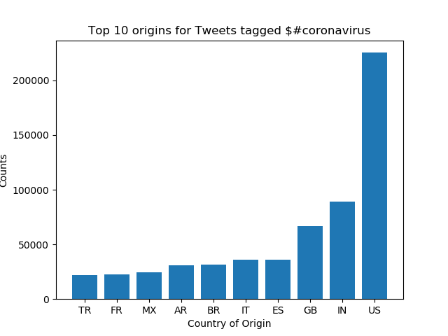
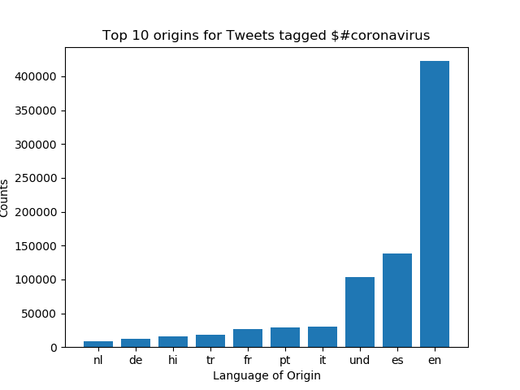
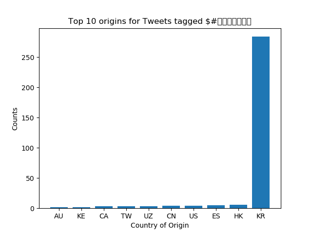
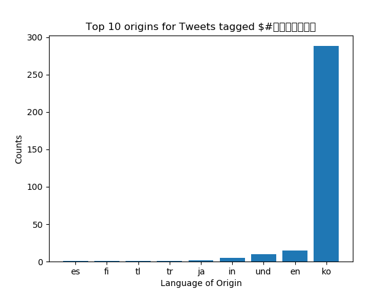

# Coronavirus twitter analysis

This repo contains code to monitor the spread of coronavirus on social media using all geotagged tweets sent in 2020.

The data contains 1.1 billion tweets and there is one file for every day of 2020, organized in a JSON format.
To analyze the data efficiently, we utilize MapReduce divide-and-conquer techniques.

 
 


*Directory Structure*
```
twitter_coronavirus/
├── src/
│   ├── alternative_reduce.py
│   ├── map.py
|   ├── reduce.py
|   └── visualize.py
├── outputs/
│   ├── geoTwitter20-mm-dd.zip.country
│   └── geoTwitter20-mm-dd.zip.lang
├── images/
│   ├── reduced.country-#coronavirus.png
│   └── reduced.lang-#coronavirus.png
├── .gitignore
├── reduced.country
├── reduced.lang
├── run_maps.sh
└── README.md 
```

Running `run_maps.sh` will loop over each file in the dataset and run the `src/map.py` file on each file. The `src/reduce.py` file will collect all of the map outputs from `outputs/` and generate `reduced.country` and `reduced.lang`. Running `./src/visualize` creates a bar graph of the most common hashtags. Finally, `src/alternative_reduce.py` creates a line plot of the hashtag counts over 2020.

